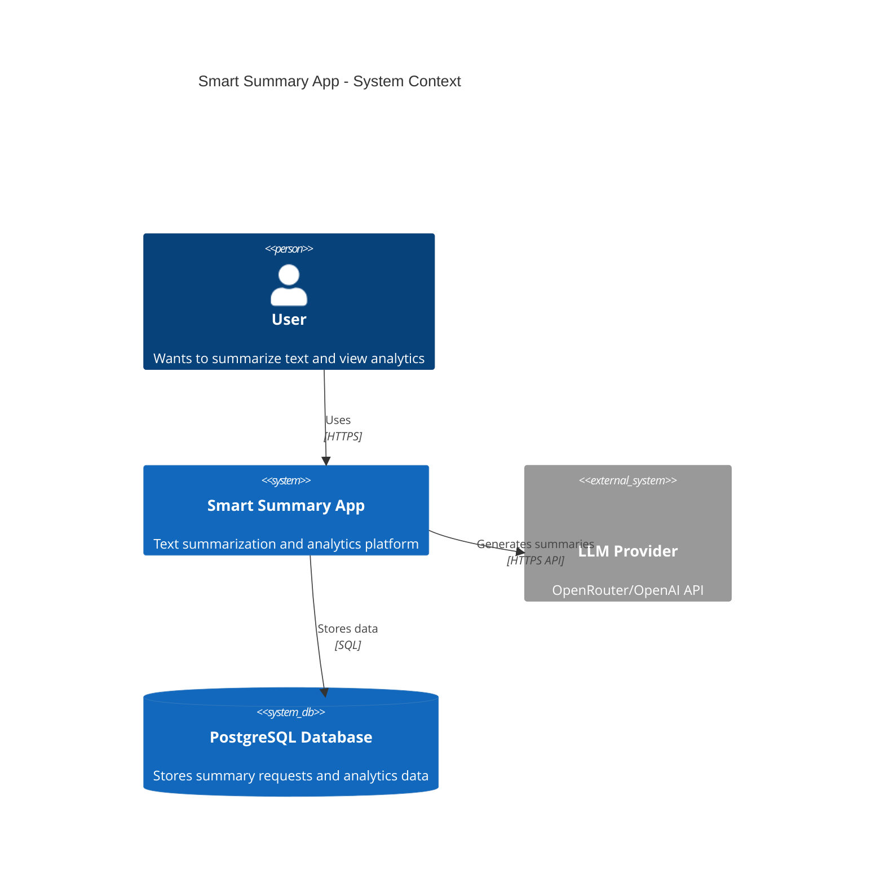
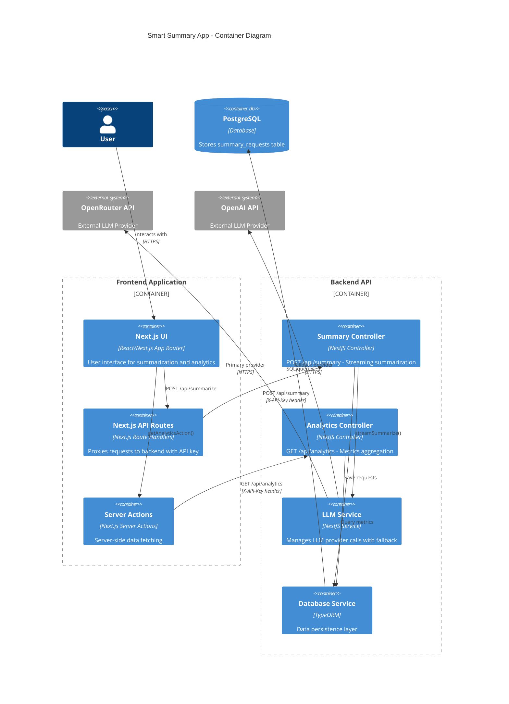

# System Architecture & Technologies

## High-Level Architecture

The Smart Summary App follows a **microservices-inspired monorepo architecture** with clear separation between frontend and backend services. The system uses a **layered architecture** pattern on the backend and a **component-based architecture** on the frontend.

## System Context Diagram



## Container Diagram



## Technology Stack

### Backend Technologies

- **Framework**: NestJS 10+
  - Modular architecture with dependency injection
  - Decorator-based routing and guards
  - Built-in validation and exception handling
- **Database ORM**: TypeORM
  - PostgreSQL driver
  - Entity-based data modeling
  - Migration support

- **Database**: PostgreSQL
  - Relational database for structured data
  - ACID compliance for data integrity

- **HTTP Server**: Express (via NestJS)
  - RESTful API endpoints
  - Server-Sent Events (SSE) streaming

- **Validation**: class-validator & class-transformer
  - DTO validation
  - Request/response transformation

- **Security**: Helmet
  - HTTP security headers
  - CORS configuration

### Frontend Technologies

- **Framework**: Next.js 14+ (App Router)
  - React Server Components
  - Server Actions for server-side operations
  - API Routes for custom endpoints

- **UI Library**: React 18+
  - Component-based UI development
  - Hooks for state management

- **Styling**: TailwindCSS
  - Utility-first CSS framework
  - Theme support via next-themes

- **Type System**: TypeScript
  - Type safety across frontend and backend
  - Shared types via monorepo package

### Shared Packages

- **Types Package**: `@smart-summary/types`
  - Shared TypeScript interfaces
  - API contract definitions
  - Used by both frontend and backend

## Architecture Patterns

### Backend Architecture

The backend follows a **modular architecture** with clear separation of concerns:

1. **Module Structure**:
   - `SummaryModule`: Handles summarization requests
   - `AnalyticsModule`: Provides metrics and analytics
   - `LLMModule`: Manages LLM provider integration
   - `DatabaseModule`: Database configuration and connection
   - `CommonModule`: Shared utilities, guards, decorators

2. **Layered Design**:
   - **Controller Layer**: HTTP request/response handling
   - **Service Layer**: Business logic and orchestration
   - **Repository Layer**: Data access (TypeORM repositories)
   - **External Layer**: LLM API integrations

### Frontend Architecture

The frontend uses **Next.js App Router** with the following structure:

1. **App Router Pages**: Route-based pages (`/`, `/analytics`, `/summarize`)
2. **Server Actions**: Server-side data fetching (`'use server'`)
3. **API Routes**: Custom endpoints for SSE streaming proxying
4. **Components**: Reusable UI components in `shared/components`
5. **Hooks**: Custom React hooks for business logic (`useStreamingSummary`)

## Component Interactions

### Summarization Flow

```
User → Next.js UI → API Route (/api/summarize)
  → NestJS Controller (/api/summary)
  → SummaryService → LLMService
  → OpenRouter/OpenAI API
  → Stream chunks back through chain
  → Update database with results
```

### Analytics Flow

```
User → Next.js UI → Server Action
  → NestJS Controller (/api/analytics)
  → AnalyticsService → TypeORM Repository
  → PostgreSQL queries
  → Aggregated metrics returned
```

## Data Flow Architecture

### Request Processing

1. **Client Request**: User submits text via web form
2. **API Gateway**: Next.js API route proxies request with API key
3. **Authentication**: Backend validates API key via `ApiKeyGuard`
4. **Service Layer**: Summary service orchestrates the flow
5. **LLM Integration**: LLM service calls provider API
6. **Streaming**: Chunks streamed back to client via SSE
7. **Persistence**: Request metadata saved to database

### Error Handling Flow

- Errors caught at service layer
- Error details logged to database
- Error chunks sent via SSE stream
- Frontend displays user-friendly error messages

## Scalability Considerations

### Current Architecture Assumptions

- Single instance deployments
- Direct database connections (no connection pooling issues expected at current scale)
- Synchronous request processing
- In-memory state management (no external cache)

### Potential Scalability Improvements

- **Horizontal Scaling**: Stateless backend allows multiple instances
- **Database Optimization**: Connection pooling, read replicas for analytics
- **Caching**: Redis for frequently accessed analytics data
- **Queue System**: Message queue for LLM requests to handle rate limits
- **CDN**: Static asset delivery via CDN for frontend

## Security Architecture

### Authentication & Authorization

- **API Key Authentication**: Shared secret for backend access
- **Header-based Validation**: `X-API-Key` header required
- **Server-side Key Management**: API keys never exposed to client

### Network Security

- **HTTPS Only**: All external communication over HTTPS
- **CORS Configuration**: Restricted origins in production
- **Security Headers**: Helmet middleware for HTTP security headers

### Data Security

- **Input Validation**: All inputs validated via DTOs
- **SQL Injection Prevention**: TypeORM parameterized queries
- **Error Sanitization**: Sensitive data not exposed in error messages

## Deployment Architecture

### Development Environment

- Local PostgreSQL database
- Backend runs on port 3000
- Frontend runs on port 3001
- Environment variables via `.env.local`

### Production Environment

- **Recommended**: Containerized deployment (Docker)
- **Database**: Managed PostgreSQL service
- **Frontend**: Next.js deployment (Vercel, self-hosted, or containerized)
- **Backend**: Container orchestration (Docker Compose, Kubernetes)
- **Environment Variables**: Secure secret management

## Technology Choices Rationale

### NestJS

**Why**: Enterprise-grade framework with excellent TypeScript support, dependency injection, and modular architecture. Perfect for building scalable APIs.

### Next.js App Router

**Why**: Modern React framework with excellent developer experience, built-in optimizations, and server-side capabilities that reduce client-side bundle size.

### TypeORM

**Why**: Mature ORM with excellent TypeScript support, migration capabilities, and active query builder for complex analytics queries.

### PostgreSQL

**Why**: Robust relational database with excellent performance, ACID compliance, and powerful querying capabilities for analytics.

### SSE (Server-Sent Events)

**Why**: Simpler than WebSockets for one-way streaming, built-in reconnection support, and works over standard HTTP/HTTPS.

## Architecture Assumptions

1. **Monolithic Backend**: All backend modules in single process (could be split later)
2. **Direct Database Access**: No separate data service layer (acceptable for current scale)
3. **Synchronous Processing**: No async job queue for LLM calls (handled in request lifecycle)
4. **Single API Key**: Shared API key for all requests (no per-user authentication)
5. **No Caching Layer**: Direct database queries for analytics (could add Redis later)
