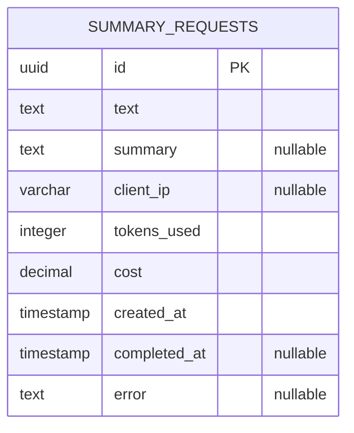
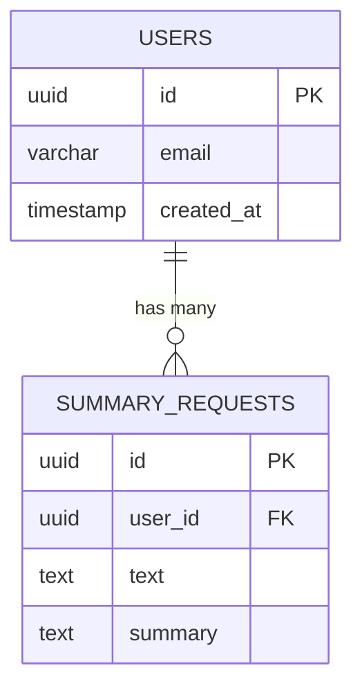

# Data Structure & Database Schema

## Database Overview

The Smart Summary App uses **PostgreSQL** as its primary database, managed through **TypeORM**. The database stores summary request metadata, including input text, generated summaries, token usage, costs, and timestamps.

## Entity-Relationship Diagram



## Database Schema

### Summary Requests Table

The `summary_requests` table is the primary data store for all summarization operations.

```1:40:/home/renato-siqueira/Projects/Smart-Summary-App/apps/backend/src/database/entities/summary-request.entity.ts
import {
  Entity,
  PrimaryGeneratedColumn,
  Column,
  CreateDateColumn,
  Index,
} from 'typeorm';

@Entity('summary_requests')
@Index(['clientIp'])
@Index(['createdAt'])
export class SummaryRequest {
  @PrimaryGeneratedColumn('uuid')
  id: string;

  @Column('text')
  text: string;

  @Column('text', { nullable: true })
  summary: string | null;

  @Column({ name: 'client_ip', type: 'varchar', nullable: true })
  clientIp: string | null;

  @Column({ name: 'tokens_used', type: 'integer', default: 0 })
  tokensUsed: number;

  @Column({ type: 'decimal', precision: 10, scale: 6, default: 0 })
  cost: number;

  @CreateDateColumn({ name: 'created_at' })
  createdAt: Date;

  @Column({ name: 'completed_at', type: 'timestamp', nullable: true })
  completedAt: Date | null;

  @Column({ type: 'text', nullable: true })
  error: string | null;
}
```

### Table Structure

| Column Name    | Type          | Constraints       | Description                                 |
| -------------- | ------------- | ----------------- | ------------------------------------------- |
| `id`           | UUID          | PRIMARY KEY       | Unique identifier for each request          |
| `text`         | TEXT          | NOT NULL          | Original text input from user               |
| `summary`      | TEXT          | NULLABLE          | Generated summary (null until completion)   |
| `client_ip`    | VARCHAR       | NULLABLE, INDEXED | Client IP address for analytics             |
| `tokens_used`  | INTEGER       | DEFAULT 0         | Total tokens consumed (prompt + completion) |
| `cost`         | DECIMAL(10,6) | DEFAULT 0         | Calculated cost in USD                      |
| `created_at`   | TIMESTAMP     | NOT NULL, INDEXED | Request creation timestamp                  |
| `completed_at` | TIMESTAMP     | NULLABLE          | Completion timestamp (null if failed)       |
| `error`        | TEXT          | NULLABLE          | Error message if request failed             |

### Indexes

1. **`clientIp` Index**: Enables efficient filtering by client IP in analytics queries
2. **`createdAt` Index**: Supports date-range queries and time-series analytics

**SQL for Indexes**:

```sql
CREATE INDEX "IDX_summary_requests_clientIp" ON "summary_requests" ("client_ip");
CREATE INDEX "IDX_summary_requests_createdAt" ON "summary_requests" ("created_at");
```

### Constraints

- **Primary Key**: `id` (UUID, auto-generated)
- **Not Null Constraints**: `text`, `tokens_used`, `cost`, `created_at`
- **Default Values**: `tokens_used = 0`, `cost = 0`

## Data Relationships

Currently, the database has a **single table design** suitable for MVP. All summary requests are stored in one table with no foreign key relationships.

### Potential Future Relationships

If multi-tenancy or user management is added:



## Data Lifecycle

### Request Creation

When a new summarization request is created:

1. **Initial State**: Record created with:
   - `text`: User input
   - `clientIp`: Extracted from request headers
   - `tokensUsed`: 0
   - `cost`: 0
   - `summary`: null
   - `completedAt`: null
   - `error`: null

```1:32:/home/renato-siqueira/Projects/Smart-Summary-App/apps/backend/src/summary/summary.service.ts
async createSummaryRequest(
  text: string,
  clientIp?: string,
): Promise<SummaryRequest> {
  const summaryRequest = this.summaryRequestRepository.create({
    text,
    clientIp,
    tokensUsed: 0,
    cost: 0,
    summary: null,
    completedAt: null,
    error: null,
  });

  return await this.summaryRequestRepository.save(summaryRequest);
}
```

### Request Completion

When summarization completes successfully:

1. **Update Record**: Summary data persisted:
   - `summary`: Generated summary text
   - `tokensUsed`: Total tokens from LLM response
   - `cost`: Calculated cost based on model and tokens
   - `completedAt`: Current timestamp

```35:45:/home/renato-siqueira/Projects/Smart-Summary-App/apps/backend/src/summary/summary.service.ts
async updateSummaryRequest(
  id: string,
  summary: string,
  tokensUsed: number,
  cost: number,
  completedAt: Date,
): Promise<UpdateResult> {
  return await this.summaryRequestRepository.update(id, {
    summary,
    tokensUsed,
    cost,
    completedAt,
  });
}
```

### Request Failure

When summarization fails:

1. **Error State**: Error details persisted:
   - `error`: Error message
   - `completedAt`: Failure timestamp
   - `summary`: Remains null

```108:130:/home/renato-siqueira/Projects/Smart-Summary-App/apps/backend/src/summary/summary.service.ts
private async handleError(requestId: string, error: any): Promise<void> {
  try {
    const errorMessage =
      error instanceof Error
        ? error.message
        : typeof error === 'string'
          ? error
          : JSON.stringify(error);

    const errorType =
      error instanceof Error
        ? error.name || error.constructor?.name || 'Error'
        : 'UnknownError';

    console.error(`[SummaryService] Summary request ${requestId} failed:`, {
      requestId,
      errorType,
      errorMessage,
      error: error instanceof Error ? error.stack : error,
    });

    await this.summaryRequestRepository.update(requestId, {
      error: errorMessage,
      completedAt: new Date(),
    });
  } catch (updateError) {
    console.error(
      `[SummaryService] Failed to update error info for request ${requestId}:`,
      updateError,
    );
  }
}
```

## Database Configuration

### TypeORM Configuration

```1:35:/home/renato-siqueira/Projects/Smart-Summary-App/apps/backend/src/database/database.module.ts
import { Module } from '@nestjs/common';
import { TypeOrmModule } from '@nestjs/typeorm';
import { ConfigModule, ConfigService } from '@nestjs/config';
import { AppConfig } from '../config/config.interface';

@Module({
  imports: [
    TypeOrmModule.forRootAsync({
      imports: [ConfigModule],
      inject: [ConfigService],
      useFactory: (configService: ConfigService<{ app: AppConfig }>) => {
        const appConfig = configService.get<AppConfig>('app')!;
        const nodeEnv = appConfig.environment;

        return {
          type: 'postgres',
          url: appConfig.database.url,
          entities: [__dirname + '/entities/**/*.entity{.ts,.js}'],
          migrations: [__dirname + '/migrations/**/*{.ts,.js}'],
          synchronize: false,
          logging:
            nodeEnv === 'development'
              ? ['query', 'error', 'schema', 'warn']
              : ['error', 'warn'],
          migrationsRun: false,
          migrationsTableName: 'migrations',
          ssl: nodeEnv === 'production' ? { rejectUnauthorized: false } : false,
        };
      },
    }),
  ],
  exports: [TypeOrmModule],
})
export class DatabaseModule {}
```

### Key Configuration Points

1. **`synchronize: false`**: Schema managed via migrations (never auto-sync in production)
2. **Migrations**: Version-controlled schema changes
3. **SSL**: Enabled in production with `rejectUnauthorized: false` (adjust per environment)
4. **Logging**: Verbose in development, errors only in production

## Query Patterns

### Analytics Queries

The analytics service performs aggregate queries:

```1:165:/home/renato-siqueira/Projects/Smart-Summary-App/apps/backend/src/analytics/analytics.service.ts
async getMetrics(
  startDate?: Date,
  endDate?: Date,
  clientIp?: string,
): Promise<AnalyticsResponseDto> {
  const queryBuilder =
    this.summaryRequestRepository.createQueryBuilder('request');

  if (startDate || endDate) {
    if (startDate && endDate) {
      queryBuilder.where(
        'request.createdAt BETWEEN :startDate AND :endDate',
        {
          startDate,
          endDate,
        },
      );
    } else if (startDate) {
      queryBuilder.where('request.createdAt >= :startDate', { startDate });
    } else if (endDate) {
      queryBuilder.where('request.createdAt <= :endDate', { endDate });
    }
  }

  if (clientIp) {
    if (startDate || endDate) {
      queryBuilder.andWhere('request.clientIp = :clientIp', { clientIp });
    } else {
      queryBuilder.where('request.clientIp = :clientIp', { clientIp });
    }
  }

  queryBuilder.andWhere('request.completedAt IS NOT NULL');
  queryBuilder.andWhere('request.error IS NULL');

  const result = await queryBuilder
    .select('COUNT(request.id)', 'totalRequests')
    .addSelect('SUM(request.tokensUsed)', 'totalTokensUsed')
    .addSelect('SUM(request.cost)', 'totalCost')
    .getRawOne();

  // ... aggregation logic
}
```

### Daily Metrics Query

Groups metrics by day using PostgreSQL `DATE_TRUNC`:

```87:130:/home/renato-siqueira/Projects/Smart-Summary-App/apps/backend/src/analytics/analytics.service.ts
private async getDailyMetrics(
  startDate?: Date,
  endDate?: Date,
  clientIp?: string,
): Promise<DailyMetric[]> {
  const queryBuilder =
    this.summaryRequestRepository.createQueryBuilder('request');

  // ... filter logic ...

  const results = await queryBuilder
    .select("DATE_TRUNC('day', request.createdAt)", 'date')
    .addSelect('COUNT(request.id)', 'requests')
    .addSelect('SUM(request.tokensUsed)', 'tokensUsed')
    .addSelect('SUM(request.cost)', 'cost')
    .groupBy("DATE_TRUNC('day', request.createdAt)")
    .orderBy("DATE_TRUNC('day', request.createdAt)", 'ASC')
    .getRawMany();

  return results.map((row) => {
    // ... transform results ...
  });
}
```

## Data Types and Constraints

### UUID Primary Keys

- **Type**: UUID v4 (auto-generated)
- **Rationale**: Globally unique identifiers, suitable for distributed systems
- **Usage**: Used as primary key for all requests

### Decimal Precision

- **Type**: `DECIMAL(10, 6)`
- **Rationale**: Cost stored with 6 decimal places for precision (handles fractional cents)
- **Example**: `0.001234` USD

### Timestamps

- **Type**: `TIMESTAMP`
- **Timezone**: Database server timezone (consider UTC for production)
- **Created**: Auto-set on insert via `@CreateDateColumn`
- **Completed**: Manually set on completion

### Text Fields

- **`text`**: User input (arbitrary length)
- **`summary`**: Generated summary (arbitrary length)
- **`error`**: Error messages (arbitrary length)

**Consideration**: Large text fields may impact query performance. Consider text search indexes if full-text search is needed.

## Indexing Strategy

### Current Indexes

1. **`clientIp` Index**:
   - Purpose: Filter requests by client IP
   - Usage: Analytics filtering
   - Cardinality: Medium (depends on unique clients)

2. **`createdAt` Index**:
   - Purpose: Date-range queries
   - Usage: Time-series analytics
   - Cardinality: High (one per request)

### Recommended Future Indexes

If query patterns evolve, consider:

1. **Composite Index**: `(createdAt, clientIp)`
   - For analytics queries filtering by both date and IP

2. **Partial Index**: `WHERE completedAt IS NOT NULL`
   - For analytics queries that only consider completed requests

3. **Full-Text Search Index**:
   - On `text` or `summary` columns if search functionality is added

## Data Retention and Archival

### Current Approach

- All data retained indefinitely
- No automatic cleanup or archival

### Recommendations for Scale

1. **Data Retention Policy**: Define retention period (e.g., 90 days, 1 year)
2. **Archival Strategy**: Move old data to separate archival table or cold storage
3. **Partitioning**: Partition table by date for easier data management
4. **Soft Deletes**: Consider `deleted_at` column instead of hard deletes

## Migration Strategy

### TypeORM Migrations

Schema changes managed via TypeORM migrations:

- Location: `src/database/migrations/`
- Naming: `{timestamp}-{description}.ts`
- Execution: Manual via CLI or automation

### Migration Best Practices

1. **Always use migrations** (never `synchronize: true` in production)
2. **Test migrations** on staging before production
3. **Backward compatibility** where possible
4. **Rollback plans** for risky migrations

## Performance Considerations

### Query Optimization

- **Use indexes** for filtered columns (`clientIp`, `createdAt`)
- **Limit result sets** for analytics queries (pagination if needed)
- **Use `SELECT` specific columns** instead of `SELECT *`

### Connection Pooling

TypeORM manages connection pooling automatically. Configure pool size based on expected load:

```typescript
{
  // ... other config
  extra: {
    max: 20, // Maximum pool size
    min: 5,  // Minimum pool size
  }
}
```

## Security Considerations

### Data Privacy

1. **PII in Text**: User input may contain personally identifiable information
   - Consider encryption at rest for `text` column
   - Implement data retention policies
   - Audit access to raw text data

2. **Client IP**: Tracked for analytics
   - Consider anonymization or hashing if privacy concerns arise
   - Comply with GDPR/privacy regulations

### SQL Injection Prevention

TypeORM uses parameterized queries, preventing SQL injection:

```typescript
queryBuilder.where('request.createdAt >= :startDate', { startDate });
```

## Database Assumptions

1. **Single Table Design**: Sufficient for MVP, can be extended with relationships later
2. **PostgreSQL Features**: Uses PostgreSQL-specific features (e.g., `DATE_TRUNC`)
3. **No Read Replicas**: Direct database access (acceptable for current scale)
4. **Connection Pooling**: Handled by TypeORM automatically
5. **Backup Strategy**: Assumes database backups managed at infrastructure level
