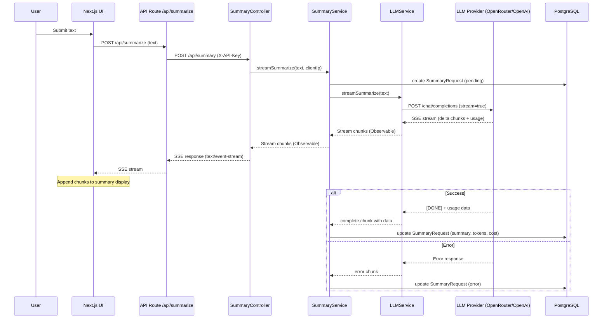
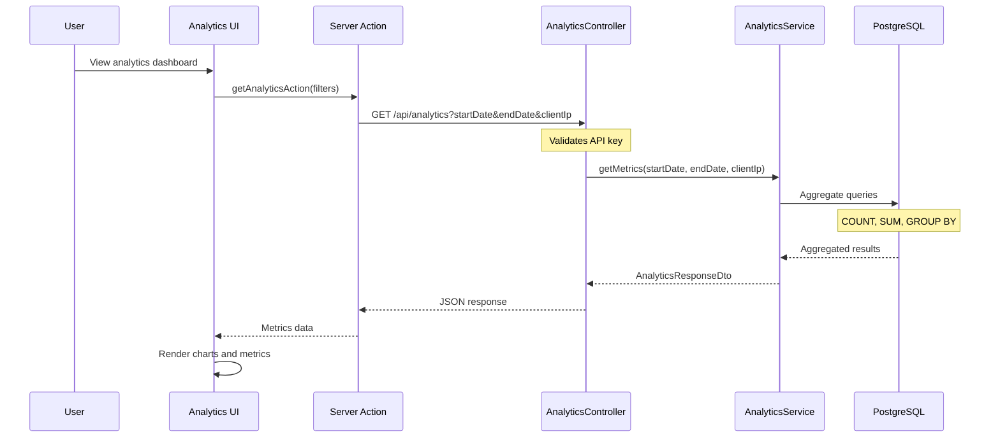
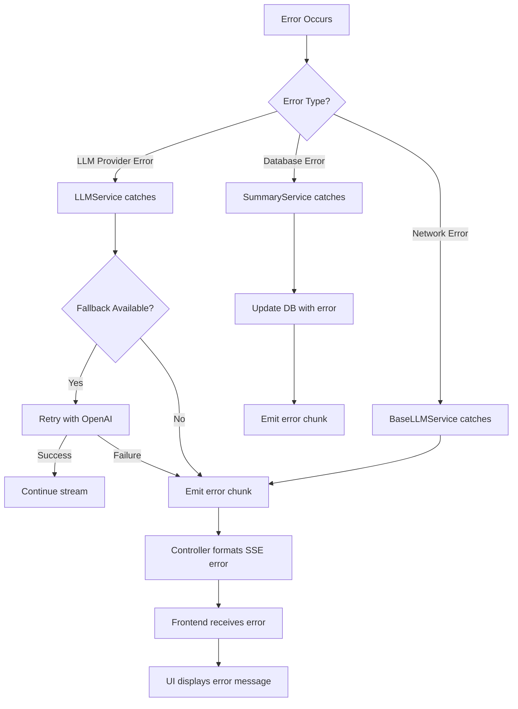

# Data Flow & Processing

## Overview

This document describes how data flows through the Smart Summary App, from user input to final output, including all processing steps and interactions between components.

## Summarization Flow

### High-Level Sequence



### Detailed Processing Steps

#### 1. User Input Submission

**Frontend**: User enters text in `SummarizeForm` component

```typescript
// User submits form
const handleSubmit = (text: string) => {
  startStreaming(text);
};
```

#### 2. Frontend API Call

**Frontend**: `useStreamingSummary` hook initiates SSE connection

```1:167:/home/renato-siqueira/Projects/Smart-Summary-App/apps/frontend/src/app/summarize/hooks/useStreamingSummary.ts
const startStreaming = useCallback(
  async (text: string) => {
    setState({
      summary: '',
      isStreaming: true,
      isComplete: false,
    });

    try {
      const cleanup = await createPostSSEConnection(
        '/api/summarize',
        { text },
        '',
        (chunk: StreamChunk) => {
          switch (chunk.type) {
            case 'start':
              setState((prev) => ({
                ...prev,
                isStreaming: true,
                summary: '',
              }));
              break;

            case 'chunk':
              if (chunk.content) {
                setState((prev) => ({
                  ...prev,
                  summary: prev.summary + chunk.content,
                }));
              }
              break;

            case 'complete':
              if (chunk.data) {
                setState({
                  summary: chunk.data.summary,
                  isStreaming: false,
                  isComplete: true,
                  tokensUsed: chunk.data.tokensUsed,
                  cost: chunk.data.cost,
                  model: chunk.data.model,
                });
                onComplete?.(chunk.data);
                cleanup?.();
                cleanupRef.current = null;
              }
              break;

            case 'error':
              if (chunk.error) {
                const errorMessage =
                  chunk.error || 'Streaming error occurred';
                const error: Error = new Error(errorMessage);
                setState((prev) => ({
                  ...prev,
                  isStreaming: false,
                  error: error.message,
                }));
                onError?.(error);
                cleanup?.();
                cleanupRef.current = null;
              }
              break;
          }
        },
        // ... error handler ...
      );

      cleanupRef.current = cleanup;
    } catch (error) {
      // Error handling
    }
  },
  [onComplete, onError],
);
```

#### 3. Next.js API Route Proxy

**Frontend API Route**: Proxies request to backend with API key

```1:90:/home/renato-siqueira/Projects/Smart-Summary-App/apps/frontend/src/app/api/summarize/route.ts
export async function POST(request: NextRequest) {
  try {
    const body = await request.json();
    const { text } = body;

    if (!text || typeof text !== 'string') {
      return new Response(JSON.stringify({ error: 'Text is required' }), {
        status: 400,
        headers: { 'Content-Type': 'application/json' },
      });
    }

    const apiKey = getApiKey();
    const backendUrl = `${BACKEND_URL}/api/summary`;

    // Forward the request to backend with API key
    const response = await fetch(backendUrl, {
      method: 'POST',
      headers: {
        'Content-Type': 'application/json',
        'X-API-Key': apiKey,
      },
      body: JSON.stringify({ text }),
    });

    if (!response.ok) {
      return new Response(
        JSON.stringify({
          error: `Backend request failed: ${response.statusText}`,
        }),
        {
          status: response.status,
          headers: { 'Content-Type': 'application/json' },
        },
      );
    }

    if (!response.body) {
      return new Response(
        JSON.stringify({ error: 'Backend response body is null' }),
        {
          status: 500,
          headers: { 'Content-Type': 'application/json' },
        },
      );
    }

    // Stream the response back to the client
    return new Response(response.body, {
      headers: {
        'Content-Type': 'text/event-stream',
        'Cache-Control': 'no-cache',
        Connection: 'keep-alive',
      },
    });
  } catch (error) {
    // Error handling
  }
}
```

#### 4. Backend Controller Processing

**Backend**: SummaryController receives request, validates API key, initiates streaming

```1:111:/home/renato-siqueira/Projects/Smart-Summary-App/apps/backend/src/summary/summary.controller.ts
@Post()
@HttpCode(HttpStatus.OK)
async streamSummarize(
  @Body() body: SummarizeRequestDto,
  @ClientIp() clientIp: string,
  @Res() res: Response,
): Promise<void> {
  res.setHeader('Content-Type', 'text/event-stream');
  res.setHeader('Cache-Control', 'no-cache');
  res.setHeader('Connection', 'keep-alive');
  res.setHeader('X-Accel-Buffering', 'no');

  const stream$: Observable<StreamChunk> =
    this.summaryService.streamSummarize(
      body.text,
      clientIp !== 'unknown' ? clientIp : undefined,
    );

  let subscription: Subscription | null = null;

  res.on('close', () => {
    if (subscription) {
      subscription.unsubscribe();
    }
  });

  subscription = stream$
    .pipe(
      map((chunk: StreamChunk) => {
        return this.formatSSE(chunk);
      }),
      catchError((error) => {
        // Error handling
      }),
    )
    .subscribe({
      next: (sseData: string) => {
        if (!res.closed) {
          res.write(sseData);
        }
      },
      error: (error: Error) => {
        // Error handling
      },
      complete: () => {
        if (!res.closed) {
          res.end();
        }
      },
    });
}
```

#### 5. Service Layer Orchestration

**Backend**: SummaryService creates request record, orchestrates LLM call

```1:164:/home/renato-siqueira/Projects/Smart-Summary-App/apps/backend/src/summary/summary.service.ts
streamSummarize(
  text: string,
  clientIp?: string,
  options?: SummarizeOptions,
): Observable<StreamChunk> {
  let summaryRequest: SummaryRequest | null = null;

  return new Observable<StreamChunk>((subscriber) => {
    this.createSummaryRequest(text, clientIp)
      .then((request) => {
        summaryRequest = request;

        this.llmService
          .streamSummarize(text, options)
          .pipe(
            map((chunk: StreamChunk) => {
              return chunk;
            }),
            catchError((error) => {
              if (summaryRequest) {
                this.handleError(summaryRequest.id, error).catch(() => {});
              }
              return new Observable<StreamChunk>((errorSubscriber) => {
                errorSubscriber.next({
                  type: 'error',
                  error:
                    error instanceof Error
                      ? error.message
                      : 'Unknown error occurred',
                });
                errorSubscriber.error(error);
              });
            }),
            finalize(async () => {}),
          )
          .subscribe({
            next: (chunk: StreamChunk) => {
              subscriber.next(chunk);

              if (chunk.type === 'complete' && chunk.data && summaryRequest) {
                const { summary, tokensUsed, cost } = chunk.data;
                this.updateSummaryRequest(
                  summaryRequest.id,
                  summary,
                  tokensUsed,
                  cost,
                  new Date(),
                ).catch((error) => {
                  console.error('Failed to update summary request:', error);
                });
              }
            },
            error: (error) => {
              subscriber.error(error);
            },
            complete: () => {
              subscriber.complete();
            },
          });
      })
      .catch((error) => {
        subscriber.next({
          type: 'error',
          error:
            error instanceof Error
              ? error.message
              : 'Failed to create request',
        });
        subscriber.error(error);
      });
  });
}
```

#### 6. LLM Service Processing

**Backend**: LLMService orchestrates provider calls with fallback

```1:125:/home/renato-siqueira/Projects/Smart-Summary-App/apps/backend/src/llm/llm.service.ts
streamSummarize(
  text: string,
  options?: SummarizeOptions,
): Observable<StreamChunk> {
  if (this.openRouterService) {
    return this.openRouterService.streamSummarize(text, options).pipe(
      catchError((error) => {
        if (error instanceof LLMRateLimitError) {
          this.logger.warn(
            'OpenRouter rate limit exceeded, not retrying with fallback',
          );
          return throwError(() => error);
        }

        this.logger.warn(
          `OpenRouter request failed, attempting fallback to OpenAI: ${error.message}`,
        );

        if (this.openAIService) {
          this.logger.log('Retrying with OpenAI service');
          return this.openAIService.streamSummarize(text, options).pipe(
            catchError((fallbackError) => {
              this.logger.error(
                `Both OpenRouter and OpenAI services failed. Last error: ${fallbackError.message}`,
              );
              return throwError(() => fallbackError);
            }),
          );
        }

        this.logger.error(
          `OpenRouter failed and no OpenAI fallback available: ${error.message}`,
        );
        return throwError(() => error);
      }),
    );
  }

  if (this.openAIService) {
    this.logger.log('Using OpenAI service (OpenRouter not configured)');
    return this.openAIService.streamSummarize(text, options);
  }

  throw new Error(
    'No LLM service is available. Please configure either OPENROUTER_API_KEY or OPENAI_API_KEY',
  );
}
```

#### 7. LLM Provider Streaming

**Backend**: BaseLLMService processes SSE stream from provider

```1:360:/home/renato-siqueira/Projects/Smart-Summary-App/apps/backend/src/llm/base-llm.service.ts
streamSummarize(
  text: string,
  options?: SummarizeOptions,
): Observable<StreamChunk> {
  return new Observable((subscriber) => {
    const model = options?.model || this.getDefaultModel();
    const maxTokens = options?.maxTokens || DEFAULT_MAX_TOKENS;
    const temperature = options?.temperature ?? 0.7;

    subscriber.next({
      type: 'start',
    });

    const messages = this.buildMessages(text);
    fetch(`${this.apiUrl}/chat/completions`, {
      method: 'POST',
      headers: this.buildRequestHeaders(),
      body: JSON.stringify({
        model,
        messages,
        max_tokens: maxTokens,
        temperature,
        stream: true,
      }),
    })
      .then(async (response) => {
        if (!response.ok) {
          await this.handleErrorResponse(response);
        }

        if (!response.body) {
          throw new LLMServiceError('Response body is null');
        }

        this.processStream(response.body, model, subscriber, text, messages);
      })
      .catch((error) => {
        this.handleStreamError(error, subscriber);
      });
  });
}
```

**Stream Processing**:

```typescript
private async processStream(
  body: ReadableStream<Uint8Array>,
  model: string,
  subscriber: any,
  originalText: string,
  messages: Array<{ role: string; content: string }>,
): Promise<void> {
  const reader = body.getReader();
  const decoder = new TextDecoder();
  let buffer = '';
  let fullSummary = '';
  let usageData: any = null;

  try {
    while (true) {
      const { done, value } = await reader.read();

      if (done) {
        break;
      }

      buffer += decoder.decode(value, { stream: true });
      const lines = buffer.split('\n');
      buffer = lines.pop() || '';

      for (const line of lines) {
        if (line.trim() === '') continue;
        if (line.startsWith('data: ')) {
          const data = line.slice(6);
          if (data === '[DONE]') {
            // Stream complete - emit final chunk
            const result = this.mapResponseToResult(
              {
                choices: [{ message: { content: fullSummary } }],
                usage: usageData || {},
                model,
              },
              model,
              originalText,
              messages,
            );
            subscriber.next({
              type: 'complete',
              data: result,
            });
            subscriber.complete();
            return;
          }

          try {
            const parsed = JSON.parse(data);

            if (parsed.choices?.[0]?.delta?.content) {
              const content = parsed.choices[0].delta.content;
              fullSummary += content;
              subscriber.next({
                type: 'chunk',
                content,
              });
            }

            if (parsed.usage) {
              usageData = parsed.usage;
            }
          } catch (e) {}
        }
      }
    }

    // Emit final chunk if stream ended without [DONE]
    const result = this.mapResponseToResult(
      {
        choices: [{ message: { content: fullSummary } }],
        usage: usageData || {},
        model,
      },
      model,
      originalText,
      messages,
    );
    subscriber.next({
      type: 'complete',
      data: result,
    });

    subscriber.complete();
  } catch (error) {
    subscriber.error(error);
  }
}
```

#### 8. Database Updates

**Backend**: SummaryService updates request record with results

- **On Creation**: Request created with pending state
- **On Completion**: Summary, tokens, cost, completedAt updated
- **On Error**: Error message and completedAt updated

## Analytics Flow

### Sequence Diagram



### Processing Steps

#### 1. User Request

**Frontend**: User views analytics page, optionally applies filters

```typescript
// Analytics page component
const { data, error } = await getAnalyticsAction({
  startDate: startDate,
  endDate: endDate,
  clientIp: clientIp,
});
```

#### 2. Server Action

**Frontend**: Server action fetches analytics from backend

```1:50:/home/renato-siqueira/Projects/Smart-Summary-App/apps/frontend/src/app/analytics/actions/get-analytics.action.ts
'use server';

export async function getAnalyticsAction(filters?: {
  startDate?: Date | string;
  endDate?: Date | string;
  clientIp?: string;
}): Promise<{ success: boolean; data?: AnalyticsMetrics; error?: string }> {
  try {
    const apiKey = getApiKey();

    const params = new URLSearchParams();
    if (filters?.startDate) {
      const date =
        filters.startDate instanceof Date
          ? filters.startDate
          : new Date(filters.startDate);
      params.append('startDate', date.toISOString().split('T')[0] || '');
    }
    if (filters?.endDate) {
      const date =
        filters.endDate instanceof Date
          ? filters.endDate
          : new Date(filters.endDate);
      params.append('endDate', date.toISOString().split('T')[0] || '');
    }
    if (filters?.clientIp) {
      params.append('clientIp', filters.clientIp);
    }

    const queryString = params.toString();
    const url = `/api/analytics${queryString ? `?${queryString}` : ''}`;

    const data = await fetchFromBackend<AnalyticsMetrics>(url, {
      apiKey,
      method: 'GET',
    });

    return { success: true, data };
  } catch (error) {
    return {
      success: false,
      error:
        error instanceof Error ? error.message : 'Failed to fetch analytics',
    };
  }
}
```

#### 3. Backend Processing

**Backend**: AnalyticsService aggregates metrics

```1:165:/home/renato-siqueira/Projects/Smart-Summary-App/apps/backend/src/analytics/analytics.service.ts
async getMetrics(
  startDate?: Date,
  endDate?: Date,
  clientIp?: string,
): Promise<AnalyticsResponseDto> {
  const queryBuilder =
    this.summaryRequestRepository.createQueryBuilder('request');

  // Apply filters
  if (startDate || endDate) {
    if (startDate && endDate) {
      queryBuilder.where(
        'request.createdAt BETWEEN :startDate AND :endDate',
        {
          startDate,
          endDate,
        },
      );
    } else if (startDate) {
      queryBuilder.where('request.createdAt >= :startDate', { startDate });
    } else if (endDate) {
      queryBuilder.where('request.createdAt <= :endDate', { endDate });
    }
  }

  if (clientIp) {
    if (startDate || endDate) {
      queryBuilder.andWhere('request.clientIp = :clientIp', { clientIp });
    } else {
      queryBuilder.where('request.clientIp = :clientIp', { clientIp });
    }
  }

  queryBuilder.andWhere('request.completedAt IS NOT NULL');
  queryBuilder.andWhere('request.error IS NULL');

  // Aggregate totals
  const result = await queryBuilder
    .select('COUNT(request.id)', 'totalRequests')
    .addSelect('SUM(request.tokensUsed)', 'totalTokensUsed')
    .addSelect('SUM(request.cost)', 'totalCost')
    .getRawOne();

  const totalRequests = parseInt(result.totalRequests || '0', 10);
  const totalTokensUsed = parseFloat(result.totalTokensUsed || '0');
  const totalCost = parseFloat(result.totalCost || '0');

  const averageTokensPerRequest =
    totalRequests > 0 ? totalTokensUsed / totalRequests : 0;
  const averageCostPerRequest =
    totalRequests > 0 ? totalCost / totalRequests : 0;

  // Get daily metrics
  const requestsByDay = await this.getDailyMetrics(
    startDate,
    endDate,
    clientIp,
  );

  return new AnalyticsResponseDto({
    totalRequests,
    totalTokensUsed: Math.round(totalTokensUsed),
    totalCost: parseFloat(totalCost.toFixed(6)),
    averageTokensPerRequest: Math.round(averageTokensPerRequest),
    averageCostPerRequest: parseFloat(averageCostPerRequest.toFixed(6)),
    requestsByDay,
  });
}
```

#### 4. Daily Metrics Aggregation

**Backend**: Groups metrics by day using PostgreSQL `DATE_TRUNC`

```typescript
private async getDailyMetrics(
  startDate?: Date,
  endDate?: Date,
  clientIp?: string,
): Promise<DailyMetric[]> {
  // ... filter logic ...

  const results = await queryBuilder
    .select("DATE_TRUNC('day', request.createdAt)", 'date')
    .addSelect('COUNT(request.id)', 'requests')
    .addSelect('SUM(request.tokensUsed)', 'tokensUsed')
    .addSelect('SUM(request.cost)', 'cost')
    .groupBy("DATE_TRUNC('day', request.createdAt)")
    .orderBy("DATE_TRUNC('day', request.createdAt)", 'ASC')
    .getRawMany();

  return results.map((row) => {
    // Transform results to DailyMetric[]
  });
}
```

## Error Handling Flow

### Error Propagation



### Error Handling in Services

**SummaryService**:

```typescript
private async handleError(requestId: string, error: any): Promise<void> {
  try {
    const errorMessage =
      error instanceof Error
        ? error.message
        : typeof error === 'string'
          ? error
          : JSON.stringify(error);

    await this.summaryRequestRepository.update(requestId, {
      error: errorMessage,
      completedAt: new Date(),
    });
  } catch (updateError) {
    console.error('Failed to update error info:', updateError);
  }
}
```

**LLMService**: Handles fallback on non-rate-limit errors

**BaseLLMService**: Handles HTTP errors and stream errors

## Data Transformation

### Input Transformation

1. **User Input** → DTO validation → Service method
2. **Client IP** → Header extraction → Database field

### Stream Transformation

1. **LLM Chunks** → BaseLLMService parsing → StreamChunk objects
2. **StreamChunks** → SSE formatting → HTTP response
3. **SSE Messages** → Client parsing → UI state updates

### Output Transformation

1. **Database Record** → Analytics aggregation → AnalyticsMetrics DTO
2. **AnalyticsMetrics** → JSON serialization → Frontend response
3. **Frontend Response** → Chart data → Visual representation

## Processing Assumptions

1. **Streaming is Reliable**: Network connections are stable enough for SSE streaming
2. **Database Consistency**: TypeORM transactions handle concurrent updates
3. **Error Recovery**: Failed requests are logged but not automatically retried
4. **Token Estimation**: Token counts are accurate from provider or approximated (~4 chars/token)
5. **Cost Calculation**: Pricing models are accurate (may need updates as pricing changes)
